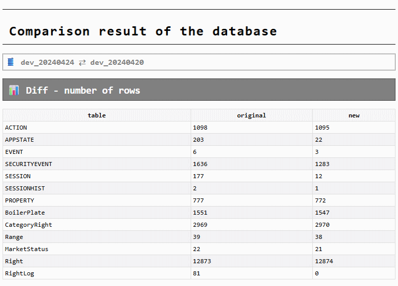

# db-compare

Compare two Microsoft SQL Server databases and generate a compact HTML report of differences.

## What it does

- Connects to two SQL Server databases and compares selected data.
- Comparison modes:
  - Number of rows: compares counts for all user tables.
  - Table: compares the content of chosen table(s) and highlights adds/updates/deletes.
  - All tables: runs table comparison across all tables with optional filters.
- Filtering options (All tables):
  - Exclude by exact name list.
  - Include only tables with given prefix(es).
- Produces an HTML report and opens it automatically in your browser.

## Screenshots

## Requirements

- Node.js 18+ recommended
- Access to Microsoft SQL Server (host/user/password)

## Install

- Install dependencies: `npm install`

## Run (interactive)

- From project root: `node index.js`
- Follow prompts:
  - Enter server, user, password
  - Select the two databases to compare
  - Choose mode: Number of rows, Table, or All tables
  - For All tables you can provide:
    - Excluded tables: comma-separated list (e.g. `Logs,AuditTrail`)
    - Filter by prefix: comma-separated prefixes (e.g. `tmp_,bak_`)

## CLI (optional)

- Link globally: `npm link`, then run `compare-db` from anywhere.

## Output

- An HTML file named like `compare-db_result-<timestamp>.html` is generated in your user data folder and opened automatically.

## Roadmap / TODO

- Support additional databases via adapters:
  - PostgreSQL (pg)
  - MySQL/MariaDB (mysql2)
  - SQLite (better-sqlite3)
  - Oracle and others (community help welcome)
- Abstract connection + query layer to handle dialect differences (identifier quoting, schema listing, paging).
- Efficient diffs for very large tables (chunked reads, primary-key aware comparisons, sampling options).
- Config profiles for multiple environments (saved server/user/db presets).
- More export formats (CSV/JSON) alongside the HTML report.
